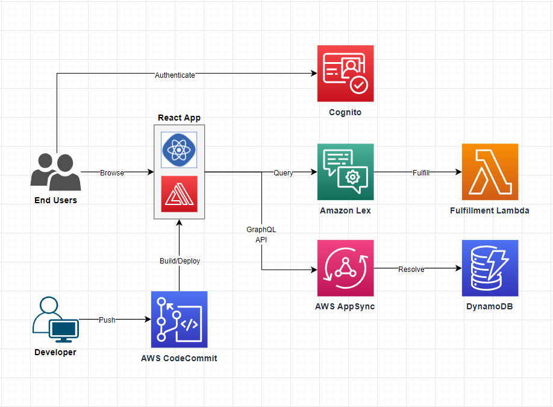

# 🤖 AI Cloud Assistant — Serverless Chatbot on AWS

An intelligent, fully serverless chatbot that allows users to interact with various AWS services (S3, EC2, Security Groups, etc.) via natural language. The assistant uses Amazon Lex for conversation, Lambda for logic, AppSync for GraphQL APIs, DynamoDB for data, and Amplify for frontend hosting.

---
## 🧱 Architecture

---

## 📌 Features

- ✅ Natural language interface via **Amazon Lex**
- ⚙️ Executes AWS operations like:
  - List/Create/Delete **S3 buckets**
  - Start/Stop/List **EC2 instances**
  - Manage **Security Group rules**
- 🧠 Business logic in **AWS Lambda**
- 📡 API via **AWS AppSync (GraphQL)**
- 🧾 Data storage in **Amazon DynamoDB**
- 🌐 Web frontend built with **React**, hosted on **AWS Amplify**
- 🔐 User login via **Amazon Cognito**

---

## 🚀 How It Works

### 1. User Authentication
- Users sign in via **Amazon Cognito User Pool**
- Cognito handles secure access for authenticated users

### 2. Conversational Flow (Amazon Lex)
- Lex bot understands intents like `s3-list-buckets`, `ec2-create`
- Each intent routes to a specific Lambda function for fulfillment

### 3. Fulfillment Logic (AWS Lambda)
- Each Lambda function handles business logic for the intent
- Uses AWS SDK to access S3, EC2, etc.
- Returns a response back to Lex or AppSync

### 4. API Integration (AWS AppSync)
- GraphQL APIs for additional app features
- Frontend uses AppSync to query task history, user settings, etc.

### 5. Frontend (React + AWS Amplify)
- Modern UI built in React
- Hosted via AWS Amplify
- Connects to Cognito, Lex, and AppSync

---

## 🛠 Technologies Used

| Tech | Purpose |
|------|---------|
| **Amazon Lex** | Natural language understanding |
| **AWS Lambda** | Serverless backend logic |
| **Amazon Cognito** | User authentication |
| **Amazon DynamoDB** | NoSQL database |
| **AWS AppSync** | GraphQL API |
| **React.js** | Frontend interface |
| **AWS Amplify** | Frontend deployment |
| **AWS SDK** | Programmatic access to AWS resources |

---

## 📁 Key Lambda Functions

| Function Name       | Description |
|---------------------|-------------|
| `s3-list-buckets`   | Lists all S3 buckets |
| `s3-create-bucket`  | Creates a new S3 bucket |
| `s3-search`         | Searches for files in a bucket |
| `ec2-create`        | Launches an EC2 instance |
| `ec2-terminate`     | Terminates an EC2 instance |
| `ec2-list`          | Lists EC2 instances |
| `sg-rule-list`      | Lists Security Group rules |
| `sg-rule-replace`   | Replaces SG rules |
| `set-region`        | Sets preferred region |
| `get-help`          | Shows available commands |
| `FallbackIntent`    | Handles unknown user input |

---

## 👨‍💻 Team Members

- **Muhammad Qzih**  
- **Weam Atawy**   
- **Wafa' Ahmad**   
- **Ahmad Baker**

---

## 📄 License

This project is for educational and demonstration purposes only. All AWS resources should be managed responsibly.

---

## 📬 Contact

For questions or contributions, please reach out to any team member or fork the project and start building!

